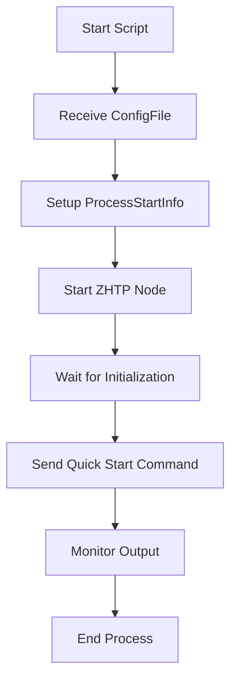

# Other — start-node-auto.ps1

# Documentation for `start-node-auto.ps1`

## Overview

The `start-node-auto.ps1` PowerShell script is designed to automate the startup of a ZHTP node with an automated wallet setup. It simplifies the process of launching the node by handling the configuration file input and sending predefined commands to the node process.

## Purpose

The primary purpose of this script is to:
- Start a ZHTP node using a specified configuration file.
- Automatically send a command to the node for a quick start option, streamlining the initialization process.

## Key Components

### Parameters

- **`$ConfigFile`**: This mandatory parameter specifies the path to the configuration file that the ZHTP node will use during startup. It is required for the script to function correctly.

### Process Initialization

1. **Node Executable Path**: 
   The script defines the path to the ZHTP executable:
   ```powershell
   $nodeExe = "H:\SOV-NET\sovereign-mono-repo\target\release\zhtp.exe"
   ```

2. **Process Start Info**: 
   A `ProcessStartInfo` object is created to configure how the ZHTP node will be started:
   ```powershell
   $psi = New-Object System.Diagnostics.ProcessStartInfo
   $psi.FileName = $nodeExe
   $psi.Arguments = "node start --config `"$ConfigFile`""
   $psi.RedirectStandardInput = $true
   $psi.RedirectStandardOutput = $true
   $psi.RedirectStandardError = $true
   $psi.UseShellExecute = $false
   $psi.CreateNoWindow = $false
   ```

### Starting the Process

- The ZHTP node process is initiated using:
  ```powershell
  $process = [System.Diagnostics.Process]::Start($psi)
  ```

- The script waits for 3 seconds to allow the node to initialize and display its prompt:
  ```powershell
  Start-Sleep -Seconds 3
  ```

### Sending Commands

- After the wait, the script sends the command "4" to the node's standard input, which corresponds to a quick start option:
  ```powershell
  $process.StandardInput.WriteLine("4")
  $process.StandardInput.Flush()
  ```

### Output Handling

- The script continuously reads the standard output of the ZHTP node process and writes it to the console until the process exits:
  ```powershell
  while (!$process.HasExited) {
      $line = $process.StandardOutput.ReadLine()
      if ($line) {
          Write-Host $line
      }
  }
  ```

## Execution Flow

The execution flow of the script can be summarized as follows:

1. **Parameter Input**: The script starts by accepting a configuration file path.
2. **Process Configuration**: It sets up the process start information for the ZHTP node.
3. **Process Launch**: The ZHTP node is launched with the specified configuration.
4. **Command Sending**: After a brief wait, the script sends a command to the node for quick startup.
5. **Output Monitoring**: The script monitors and outputs the node's standard output until the process terminates.

### Mermaid Diagram

The following diagram illustrates the execution flow of the `start-node-auto.ps1` script:



## Conclusion

The `start-node-auto.ps1` script is a straightforward yet effective tool for automating the startup of a ZHTP node. By handling the configuration and command input, it allows developers to quickly launch the node with minimal manual intervention. Understanding this script is essential for developers looking to contribute to the ZHTP node ecosystem or automate their development workflows.