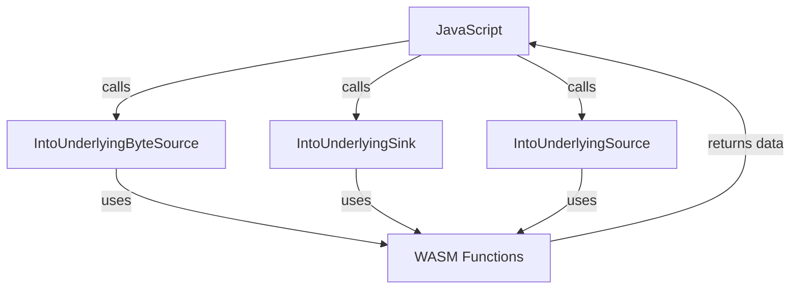

# Other — static

# Other — Static Module Documentation

## Overview

The **Other — Static** module is a JavaScript module that provides a set of classes designed to facilitate the handling of streams in a WebAssembly context. It primarily defines three classes: `IntoUnderlyingByteSource`, `IntoUnderlyingSink`, and `IntoUnderlyingSource`. These classes are used to manage byte streams, allowing for efficient data transfer between the WebAssembly module and JavaScript.

## Purpose

The main purpose of this module is to provide a bridge between JavaScript and WebAssembly for handling streams of binary data. This is particularly useful in scenarios where large amounts of data need to be processed efficiently, such as in file uploads, downloads, or real-time data processing.

## Key Components

### 1. `IntoUnderlyingByteSource`

This class represents a source of byte data that can be read from a stream. It provides methods to control the stream's behavior and manage its lifecycle.

#### Methods

- **`__destroy_into_raw()`**: Cleans up the internal pointer and unregisters the instance from finalization.
- **`free()`**: Frees the resources associated with the instance.
- **`get autoAllocateChunkSize()`**: Returns the size of the chunks that will be automatically allocated.
- **`cancel()`**: Cancels the stream, releasing any resources.
- **`pull(controller)`**: Pulls data from the source into the provided `ReadableByteStreamController`.
- **`start(controller)`**: Initializes the stream and sets up the controller.
- **`get type()`**: Returns the type of the stream, which is always `bytes`.

### 2. `IntoUnderlyingSink`

This class represents a sink for byte data that can be written to a stream. It provides methods to manage the writing process and handle errors.

#### Methods

- **`__destroy_into_raw()`**: Cleans up the internal pointer and unregisters the instance from finalization.
- **`free()`**: Frees the resources associated with the instance.
- **`abort(reason)`**: Aborts the writing process with a specified reason.
- **`close()`**: Closes the sink, indicating that no more data will be written.
- **`write(chunk)`**: Writes a chunk of data to the sink.

### 3. `IntoUnderlyingSource`

This class represents a source of data that can be read from a stream. It is similar to `IntoUnderlyingByteSource` but is designed for more general data types.

#### Methods

- **`__destroy_into_raw()`**: Cleans up the internal pointer and unregisters the instance from finalization.
- **`free()`**: Frees the resources associated with the instance.
- **`cancel()`**: Cancels the stream, releasing any resources.
- **`pull(controller)`**: Pulls data from the source into the provided `ReadableStreamDefaultController`.

## Execution Flow

The execution flow of this module is primarily driven by the interaction between the JavaScript classes and the underlying WebAssembly functions. The following diagram illustrates the key interactions:

### Initialization

The module is initialized using the `initSync` or `__wbg_init` functions, which load the WebAssembly module and set up the necessary imports. This process involves:

1. Loading the WebAssembly module.
2. Initializing the memory and setting up the environment.
3. Making the classes available for use in JavaScript.

### Memory Management

Memory management is handled through a combination of JavaScript and WebAssembly. The classes utilize internal pointers to manage resources, and the `free()` method is provided to ensure that resources are released when no longer needed.

### Error Handling

The module includes robust error handling through the `handleError` function, which captures exceptions thrown during the execution of WebAssembly functions and stores them for later retrieval.

## Integration with the Codebase

This module is designed to be used in conjunction with other parts of the codebase that require efficient data streaming capabilities. It connects to various components, such as:

- **File Uploads/Downloads**: The classes can be used to manage the streaming of file data to and from the server.
- **Real-time Data Processing**: The module can handle streams of data in real-time applications, such as video or audio processing.
- **WebAssembly Interactions**: The classes provide a seamless way to interact with WebAssembly modules, allowing for efficient data transfer without the overhead of converting data formats.

## Conclusion

The **Other — Static** module is a crucial component for managing byte streams in a WebAssembly context. Its design allows for efficient data handling, making it suitable for a variety of applications that require high-performance data processing. By understanding the key components and their interactions, developers can effectively utilize this module in their projects.