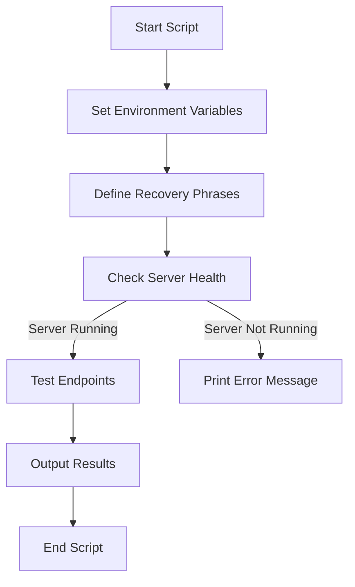

# Other — test_recovery_api.sh

# Documentation for `test_recovery_api.sh`

## Overview

The `test_recovery_api.sh` script is a Bash-based testing utility designed to validate the functionality of the ZHTP API endpoints related to recovery phrase management. It specifically tests the verification, recovery, and restoration of identities using 20-word and 24-word recovery phrases, while also handling invalid phrases. This script is intended for developers who need to ensure the reliability of the recovery API endpoints in a local development environment.

## Purpose

The primary purpose of this script is to automate the testing of the ZHTP API's recovery phrase functionalities. It checks the following endpoints:

- **Verify Recovery Phrase**: Validates if a given recovery phrase is acceptable.
- **Recover Identity**: Attempts to recover an identity using a valid recovery phrase.
- **Restore from Seed**: Restores an identity from a seed phrase.

## Prerequisites

- A running instance of the ZHTP server on `localhost:8000`.
- The script requires the `curl` command-line tool to send HTTP requests.

## Key Components

### Environment Variables

- **`ZHTP_SERVER`**: This variable defines the base URL of the ZHTP server. If not set, it defaults to `http://localhost:8000`.

### Test Credentials

- **`IDENTITY_ID`**: A placeholder identity ID used in the API requests.
- **`SESSION_TOKEN`**: A placeholder session token used in the API requests.

### Recovery Phrases

The script defines three types of recovery phrases:

- **`PHRASE_20`**: A valid 20-word recovery phrase.
- **`PHRASE_24`**: A valid 24-word recovery phrase following the BIP39 standard.
- **`PHRASE_19`**: An invalid 19-word recovery phrase used to test error handling.

### Test Function

#### `test_endpoint()`

This is the core function of the script, responsible for executing the API tests. It takes the following parameters:

- **`endpoint`**: The API endpoint to test.
- **`method`**: The HTTP method (e.g., `POST`).
- **`phrase`**: The recovery phrase to test.
- **`description`**: A description of the test case.
- **`expected`**: The expected outcome of the test.

The function performs the following steps:

1. Checks if the ZHTP server is running by pinging the health endpoint.
2. Sends a POST request to the specified API endpoint with the recovery phrase and test credentials.
3. Outputs the response from the server and checks if it matches the expected outcome.

### Execution Flow

The script executes a series of tests in a sequential manner, calling the `test_endpoint()` function for each of the defined API endpoints. The results are printed to the console for easy review.

### API Endpoints Tested

1. **`/api/v1/identity/backup/verify`**: Tests the verification of recovery phrases.
2. **`/api/v1/identity/recover`**: Tests the recovery of identities using recovery phrases.
3. **`/api/v1/identity/restore/seed`**: Tests the restoration of identities from seed phrases.

## Running the Script

To run the script against a live server, you can set the `ZHTP_SERVER` environment variable as follows:

```bash
ZHTP_SERVER=http://localhost:8000 ./test_recovery_api.sh
```

Alternatively, you can export the variable and then run the script:

```bash
export ZHTP_SERVER=http://localhost:8000
./test_recovery_api.sh
```

## Summary of Results

At the end of the script execution, a summary is printed, indicating which recovery phrases were accepted and which were rejected. Valid phrases (20 or 24 words) are expected to return a success message, while any other length will return an error.

## Conclusion

The `test_recovery_api.sh` script is a vital tool for developers working with the ZHTP API, ensuring that recovery phrase functionalities are working as intended. By automating the testing process, it helps maintain the integrity of the API and provides quick feedback during development.

### Mermaid Diagram

The following diagram illustrates the flow of the testing process:



This diagram provides a high-level overview of the script's execution flow, highlighting the key steps involved in testing the API endpoints.