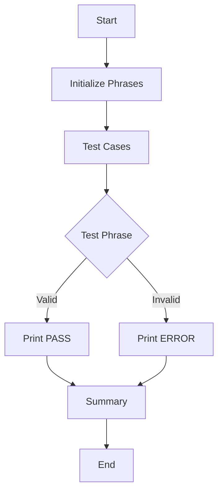

# Other — test_recovery_phrases.sh

# Documentation for `test_recovery_phrases.sh`

## Overview

The `test_recovery_phrases.sh` script is a Bash-based testing utility designed to validate recovery phrases used in cryptocurrency wallets. It specifically tests two formats of recovery phrases: the 20-word custom ZHTP format and the 24-word BIP39 standard format. The script checks the validity of these phrases based on their word count and provides feedback on the results.

## Purpose

The primary purpose of this script is to ensure that recovery phrases conform to expected formats before they are used in production environments. This helps prevent errors related to invalid recovery phrases, which can lead to loss of access to cryptocurrency wallets.

## Key Components

### 1. **Word Count Function**

```bash
count_words() {
    echo "$1" | wc -w | tr -d ' '
}
```

- **Functionality**: This function takes a string input (the recovery phrase) and counts the number of words in it using the `wc -w` command. It then removes any whitespace from the output.
- **Usage**: This function is called within the `test_phrase` function to determine the validity of the recovery phrase based on its word count.

### 2. **Test Function**

```bash
test_phrase() {
    local phrase=$1
    local description=$2
    local expected_result=$3

    word_count=$(count_words "$phrase")

    echo "Test: $description"
    echo "  Words: $word_count"
    echo "  Expected: $expected_result"

    # Simulate the validation logic
    if [[ $word_count == 20 || $word_count == 24 ]]; then
        echo "  Result: ✅ PASS (Valid phrase)"
    else
        echo "  Result: ❌ ERROR (Invalid phrase: expected 20 or 24 words, got $word_count)"
    fi
    echo ""
}
```

- **Functionality**: This function performs the actual testing of a recovery phrase. It takes three parameters: the phrase to test, a description of the test, and the expected result.
- **Logic**: It counts the words in the phrase and checks if the count is either 20 or 24. It then prints the test results, indicating whether the phrase is valid or invalid.

### 3. **Test Cases**

The script defines several test cases to validate both valid and invalid recovery phrases:

- **Valid Cases**:
  - `PHRASE_20`: A valid 20-word custom ZHTP recovery phrase.
  - `PHRASE_24`: A valid 24-word BIP39 recovery phrase.

- **Invalid Cases**:
  - `PHRASE_19`: An invalid 19-word phrase.
  - `PHRASE_23`: An invalid 23-word phrase.

### 4. **Execution Flow**

The script executes sequentially, starting with the initialization of the recovery phrases, followed by the execution of the test cases, and finally printing a summary of the results.

```bash
echo "Test Cases:"
echo "-----------"
echo ""

test_phrase "$PHRASE_20" "20-word custom ZHTP format" "PASS"
test_phrase "$PHRASE_24" "24-word BIP39 standard format" "PASS"
test_phrase "$PHRASE_19" "19-word invalid phrase" "ERROR"
test_phrase "$PHRASE_23" "23-word invalid phrase" "ERROR"
```

### 5. **Summary Output**

At the end of the script, a summary is printed, indicating which phrases were accepted and which were rejected based on the validation logic.

## How to Use

1. **Run the Script**: Execute the script in a Bash environment. Ensure that you have the necessary permissions to run it.
   ```bash
   chmod +x test_recovery_phrases.sh
   ./test_recovery_phrases.sh
   ```

2. **Review Output**: The script will output the results of each test case, indicating whether each phrase passed or failed validation.

3. **API Testing (Optional)**: Uncomment the API testing section to validate phrases against a live API, if applicable.

## Conclusion

The `test_recovery_phrases.sh` script is a straightforward yet effective tool for validating recovery phrases in cryptocurrency applications. By ensuring that only valid phrases are accepted, it helps maintain the integrity and security of wallet access.

### Mermaid Diagram

The following diagram illustrates the flow of execution within the script:



This diagram provides a visual representation of how the script processes the recovery phrases and outputs the results.