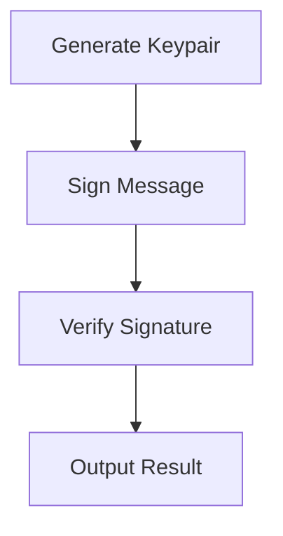

# Other — test_sig_compat.rs

# Documentation for the `test_sig_compat.rs` Module

## Overview

The `test_sig_compat.rs` module serves as a quick test utility to verify the compatibility between the signature generation of the `crystals-dilithium` library and the signature verification of the `pqcrypto-dilithium` library. This module is primarily used for testing purposes to ensure that signatures created with one library can be successfully verified by another, which is crucial for interoperability in cryptographic applications.

## Purpose

The main goal of this module is to:
- Generate a keypair using the `crystals-dilithium` library.
- Sign a predefined message using the generated secret key.
- Verify the generated signature using the `pqcrypto-dilithium` library.

This process helps in validating that the signature produced by one library can be recognized and verified by another, ensuring compatibility across different cryptographic implementations.

## Key Components

### 1. Key Generation

The module begins by generating a keypair using the `Keypair::generate` method from the `crystals-dilithium` library. A deterministic seed is used to ensure that the keypair is reproducible.

```rust
let seed = [0u8; 32]; // deterministic seed
let keypair = Keypair::generate(Some(&seed));
```

### 2. Signing

After generating the keypair, the module signs a predefined message using the secret key. The signing process is performed using the `sign` method from the `SecretKey` class.

```rust
let message = b"SEED_MIGRATE:supertramp:abc123:1234567890";
let sk = SecretKey::from_bytes(&sk_bytes);
let signature = sk.sign(message);
```

### 3. Verification

The module then attempts to verify the signature using the `pqcrypto-dilithium` library. It first converts the public key and signature from bytes to their respective types using the `from_bytes` method. Finally, it verifies the signature using the `verify_detached_signature` function.

```rust
let pq_pk = pq_d5::PublicKey::from_bytes(&pk_bytes)?;
let pq_sig = pq_d5::DetachedSignature::from_bytes(&signature)?;
match pq_d5::verify_detached_signature(&pq_sig, message, &pq_pk) {
    Ok(()) => println!("  ✅ SIGNATURE VALID"),
    Err(e) => println!("  ❌ SIGNATURE INVALID: {:?}", e),
}
```

## Execution Flow

The execution flow of the `test_sig_compat.rs` module is straightforward, as it primarily consists of sequential operations without any internal calls. The following diagram illustrates the flow of operations:



## How to Run

To execute the module, use the following command in your terminal:

```bash
cargo run --bin test_sig_compat
```

This command will compile and run the `test_sig_compat` binary, which will generate the keypair, sign the message, and attempt to verify the signature.

## Conclusion

The `test_sig_compat.rs` module is a simple yet effective tool for testing the compatibility of signature generation and verification between two different cryptographic libraries. By following the outlined steps, developers can ensure that their implementations are interoperable, which is essential for secure communication and data integrity in distributed systems. 

This module can be extended or modified to include additional tests or to handle different messages and key sizes as needed.