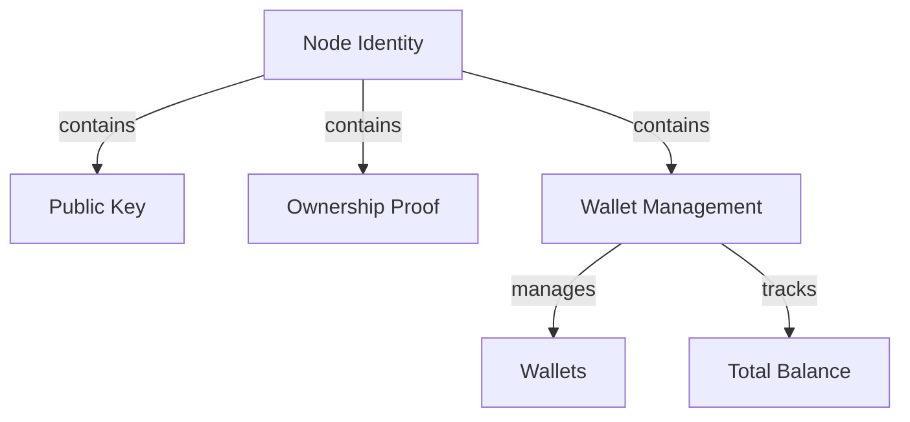

# Other — testnet

# Other — Testnet Module Documentation

## Overview

The **Other — testnet** module is designed to manage and represent the identity of nodes within a test network environment. It encapsulates various attributes related to node identity, including public keys, device identifiers, ownership proofs, and wallet management. This module is crucial for establishing secure and verifiable identities in a decentralized network, particularly in a testing context.

## Purpose

The primary purpose of this module is to provide a structured representation of node identities, which includes:

- **Node Identification**: Storing unique identifiers and public keys for devices.
- **Ownership Proofs**: Verifying ownership of the node through cryptographic proofs.
- **Wallet Management**: Managing wallets associated with the node, including balances and ownership.

## Key Components

### 1. Node Identity Structure

The node identity is represented in a JSON format, which includes several key fields:

- **id**: An array of integers representing the unique identifier for the node.
- **identity_type**: A string indicating the type of identity (e.g., "Device").
- **did**: The Decentralized Identifier (DID) for the node.
- **public_key**: Contains two types of public keys:
  - **dilithium_pk**: Public key for the Dilithium cryptographic scheme.
  - **kyber_pk**: Public key for the Kyber cryptographic scheme.
- **node_id**: Contains the node's unique identifier in byte format, along with creation nonce and network genesis.
- **device_node_ids**: Maps device identifiers to their respective byte representations.
- **ownership_proof**: Contains details about the proof of ownership, including:
  - **version**: Version of the proof system.
  - **proof_system**: The proof system used (e.g., "dilithium-pop-placeholder-v0").
  - **proof_data**: The actual proof data.
  - **public_inputs**: Public inputs required for verification.
  - **verification_key**: Key used to verify the proof.

### 2. Wallet Management

The wallet management component is responsible for handling the financial aspects of the node:

- **owner_id**: An array of integers representing the owner of the wallet.
- **wallets**: A mapping of wallet identifiers to wallet details.
- **alias_map**: A mapping of aliases to wallet identifiers.
- **total_balance**: The total balance of the wallet.
- **created_at**: Timestamp indicating when the wallet was created.

### 3. Metadata and Additional Attributes

The module also includes various metadata fields that provide additional context about the node:

- **reputation**: A numeric value representing the node's reputation.
- **age**: The age of the node, if applicable.
- **access_level**: The access level of the node (e.g., "Visitor").
- **metadata**: A flexible field for storing additional information.

## Execution Flow

Currently, there are no defined execution flows or internal, outgoing, or incoming calls within this module. This indicates that the module is primarily a data structure without active processing logic. It serves as a repository for node identity information that can be utilized by other components of the system.

## Integration with the Codebase

The **Other — testnet** module is designed to be integrated with other modules that require node identity information. It can be utilized in:

- **Identity Verification**: Other modules can call upon this module to verify the identity of nodes before allowing them to participate in network activities.
- **Wallet Operations**: Wallet management functions in other modules can leverage the wallet management structure provided in this module to handle transactions and balances.
- **Decentralized Applications**: Applications built on top of this testnet can utilize the identity information to manage user sessions and permissions.

## Conclusion

The **Other — testnet** module plays a vital role in managing node identities within a test network. By providing a structured representation of identities, public keys, and wallet management, it facilitates secure interactions in a decentralized environment. Future enhancements may include adding execution flows and integrating with other modules for more dynamic interactions.

### Diagram

This diagram illustrates the relationships between the key components of the **Other — testnet** module, highlighting how they interconnect to form a cohesive identity management system.