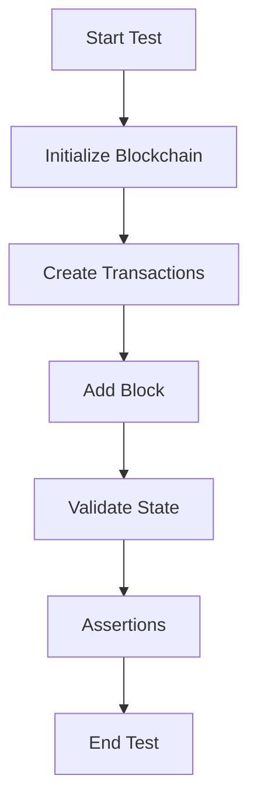

# Other — tests

# Other — Tests Module Documentation

## Overview

The **Other — tests** module is a comprehensive suite of tests designed to validate the core functionalities of the blockchain implementation. It encompasses various aspects of the blockchain, including transaction validation, identity management, consensus mechanisms, and integration with smart contracts. The tests ensure that the blockchain operates as expected under different scenarios, providing a safety net for developers when making changes to the codebase.

## Purpose

The primary purpose of this module is to:
- Validate the correctness of blockchain operations.
- Ensure that the integration of various components (like transactions, identities, and consensus) works seamlessly.
- Provide a framework for regression testing to catch potential bugs introduced by new features or changes.

## Key Components

### 1. Test Structure

The tests are organized into several files, each focusing on specific functionalities:

- **blockchain_tests.rs**: Contains tests for core blockchain functionalities, including block addition, transaction validation, identity registration, and consensus mechanisms.
- **bonding_curve_integration_tests.rs**: Tests the lifecycle of bonding curve tokens, including deployment, buying, selling, and AMM interactions.
- **consensus_integration_tests.rs**: Validates the consensus mechanisms, including validator registration, DAO governance, and reward distribution.
- **contract_dao_multinode_e2e.rs**: Tests the end-to-end functionality of DAO contracts across multiple nodes, ensuring synchronization and replay consistency.
- **difficulty_config_tests.rs**: Validates the difficulty adjustment logic and configuration parameters.
- **dao_delegate_persistence_tests.rs**: Tests the persistence of DAO delegate registrations and revocations across blockchain states.

### 2. Test Functions

Each test file contains multiple test functions that cover specific scenarios. For example:

- **test_blockchain_creation**: Validates the initial state of the blockchain upon creation.
- **test_identity_registration**: Tests the registration of identities and ensures they are correctly stored in the identity registry.
- **test_bonding_curve_full_lifecycle**: Validates the complete lifecycle of a bonding curve token, from deployment to AMM interactions.
- **test_validator_registration**: Ensures that validators can be registered correctly and that their information is stored accurately.

### 3. Helper Functions

The tests utilize several helper functions to streamline the creation of test data and scenarios. For instance:

- **create_test_transaction**: Generates a valid transaction for testing purposes.
- **create_test_validator**: Creates a validator with specific attributes for testing validator-related functionalities.
- **create_mined_block**: Constructs a mined block with specified transactions, facilitating block addition tests.

### 4. Asynchronous Testing

Many tests are asynchronous, leveraging the `tokio` runtime to handle concurrent operations. This is particularly important for testing blockchain functionalities that involve I/O operations, such as adding blocks or querying the state.

## Execution Flow

The execution flow of the tests typically follows these steps:

1. **Setup**: Initialize the blockchain and any necessary components (e.g., mempool, storage).
2. **Execution**: Call the functions under test, which may involve creating transactions, adding blocks, or interacting with smart contracts.
3. **Assertions**: Validate the outcomes using assertions to ensure that the state of the blockchain matches the expected results.
4. **Teardown**: Clean up any resources or states if necessary (though most tests are isolated).

### Example Execution Flow

## Integration with the Codebase

The tests in this module are tightly integrated with the rest of the blockchain codebase. They rely on the core blockchain functionalities defined in the `lib_blockchain` module, including:

- **Transaction Management**: Tests validate the creation, validation, and processing of transactions.
- **Block Management**: Tests ensure that blocks are added correctly and that the blockchain's state is updated accordingly.
- **Identity Management**: Tests verify that identities can be registered, updated, and revoked as expected.
- **Consensus Mechanisms**: Tests validate the behavior of validators and the consensus process, ensuring that the blockchain remains secure and functional.

## Conclusion

The **Other — tests** module serves as a critical component of the blockchain development process, providing a robust framework for validating the functionality and integrity of the blockchain. By covering a wide range of scenarios and edge cases, it helps ensure that the blockchain operates reliably and securely, allowing developers to make changes with confidence.