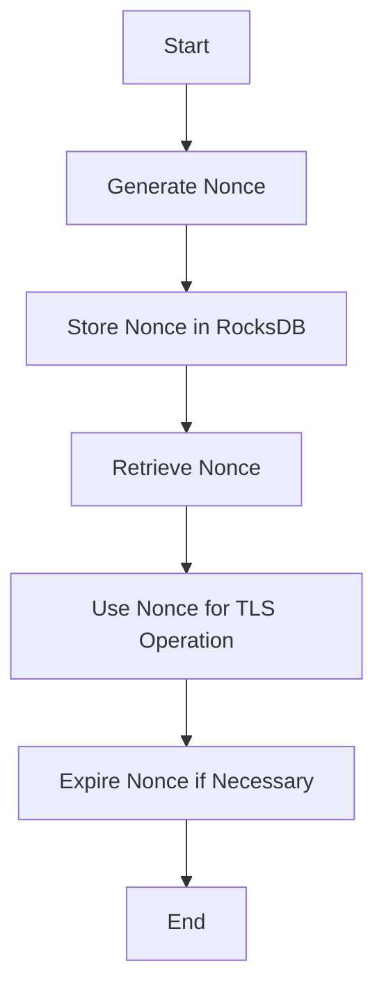

# Other — tls

# Documentation for the **Other — tls** Module

## Overview

The **Other — tls** module is designed to manage the control plane nonce cache for TLS (Transport Layer Security) operations. This module utilizes RocksDB as its underlying storage engine to efficiently handle nonce values, which are critical for ensuring the security and integrity of TLS sessions. The nonce cache is essential for preventing replay attacks and ensuring that each session is unique.

## Purpose

The primary purpose of this module is to provide a reliable and efficient mechanism for storing and retrieving nonces used in TLS operations. By leveraging RocksDB, the module can handle large volumes of nonce data while maintaining high performance and low latency.

## Key Components

### 1. RocksDB Integration

The module integrates with RocksDB, a high-performance embedded database for key-value data. The following components are crucial for its operation:

- **SST Files**: The module stores nonce data in SST (Sorted String Table) files, which are optimized for read and write operations.
- **Write-Ahead Logs (WAL)**: WAL files are used to ensure durability and recoverability of the nonce data. They log changes before they are applied to the database.
- **Manifest Files**: These files keep track of the state of the database, including the current version and the list of SST files.

### 2. Nonce Management

The module is responsible for generating, storing, and retrieving nonces. Key functions include:

- **Nonce Generation**: Nonces are generated using secure random algorithms to ensure uniqueness.
- **Storage**: Nonces are stored in RocksDB with appropriate keys to facilitate quick retrieval.
- **Expiration Management**: The module may implement expiration policies to remove old nonces and free up resources.

### 3. Configuration Options

The module provides various configuration options for tuning performance and behavior. Some notable options include:

- **max_open_files**: Limits the number of open files in RocksDB.
- **write_buffer_size**: Configures the size of the write buffer for batching writes.
- **compression**: Specifies the compression algorithm used for SST files (e.g., LZ4).

## Execution Flow

The execution flow of the **Other — tls** module is straightforward, focusing on the lifecycle of nonce management. Below is a simplified flow of operations:

## Connection to the Codebase

The **Other — tls** module connects to the broader codebase through its integration with the TLS stack. It is invoked during the establishment of TLS sessions, where it provides nonces for cryptographic operations. The module's performance and reliability are critical for maintaining the overall security posture of the application.

### Dependencies

- **RocksDB**: The module relies on the RocksDB library for data storage and retrieval.
- **TLS Library**: It interacts with the TLS library to provide nonces during session establishment.

## Conclusion

The **Other — tls** module plays a vital role in managing TLS nonces, ensuring secure communication in the application. By leveraging RocksDB, it provides efficient storage and retrieval mechanisms, contributing to the overall performance and security of the TLS operations. Developers working on this module should focus on optimizing the integration with RocksDB and ensuring that nonce management adheres to best practices for security and performance.