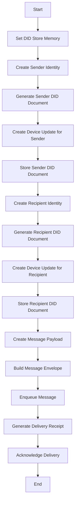

# Other — tools

# Tools Module Documentation

## Overview

The **tools** module provides an end-to-end simulation for identity management, specifically focusing on Decentralized Identifiers (DIDs). This simulation encompasses the creation of identities, device updates, message sending, and receipt handling. The primary entry point for this module is the `identity_e2e_sim` binary, which orchestrates the entire process.

## Purpose

The main goal of the `identity_e2e_sim` is to demonstrate and test the functionalities of identity management in a simulated environment. It allows developers to understand how identities are created, how messages are sent and received, and how delivery receipts are managed within the system.

## Key Components

### 1. Identity Creation

The simulation begins by creating two identities: a sender and a recipient. This is done using the `ZhtpIdentity::new_unified` function, which initializes a new identity based on the specified parameters.

```rust
let sender = ZhtpIdentity::new_unified(
    IdentityType::Human,
    Some(30),
    Some("US".to_string()),
    "sender-device",
    None,
)?;
```

### 2. DID Document Management

Once identities are created, the simulation generates DID documents for both the sender and recipient using the `DidDocument::from_identity` method. These documents are essential for managing identity attributes and public keys.

```rust
let sender_doc = lib_identity::DidDocument::from_identity(&sender, None)?;
```

### 3. Device Updates

The simulation includes functionality to add devices to the identities. This is achieved through the `create_device_add_update` function, which generates an update for the DID document.

```rust
let sender_add = create_device_add_update(
    &sender,
    &sender_doc,
    "sender-device",
    &sender.public_key.dilithium_pk,
    &sender.public_key.kyber_pk,
)?;
```

### 4. Message Creation and Sending

The core of the simulation involves creating and sending messages. The `build_identity_envelope_with_pouw` function constructs a message envelope that includes the payload and proof of unique ownership (POUW) stamp.

```rust
let envelope = build_identity_envelope_with_pouw(
    &sender_doc.id,
    &doc.id,
    &payload,
    MessageTtl::Days7,
    stamp,
)?;
```

### 5. Queue Management

Messages are queued for delivery using the `IdentityStoreForward` class. This class manages the state of messages, allowing for operations such as enqueueing messages and retrieving pending messages.

```rust
let mut queue = IdentityStoreForward::new(10);
queue.enqueue(envelope.clone())?;
```

### 6. Receipt Handling

After sending a message, the simulation generates a delivery receipt using the `create_delivery_receipt` function. This receipt confirms that the message has been delivered to the intended recipient.

```rust
let receipt = create_delivery_receipt(envelope.message_id, "phone-1", &recipient_kp)?;
```

### 7. Acknowledgment of Delivery

Finally, the simulation acknowledges the delivery of the message, removing it from the queue using the `acknowledge_delivery` method.

```rust
let removed = queue.acknowledge_delivery(&doc.id, envelope.message_id)?;
```

## Execution Flow

The execution flow of the `identity_e2e_sim` can be summarized as follows:

1. Initialize the DID store in memory.
2. Create sender and recipient identities.
3. Generate and store DID documents for both identities.
4. Create device updates for the sender and recipient.
5. Construct a message envelope and enqueue it for delivery.
6. Generate a delivery receipt for the sent message.
7. Acknowledge the delivery of the message.

### Mermaid Diagram

The following diagram illustrates the main execution flow of the `identity_e2e_sim`:



## Dependencies

The `tools` module relies on several libraries for its functionality:

- **lib-identity**: Manages identity creation and DID document handling.
- **lib-protocols**: Provides messaging protocols and envelope construction.
- **lib-network**: Handles message queuing and delivery.
- **lib-crypto**: Offers cryptographic functions, including key pair generation and hashing.

## Conclusion

The **tools** module serves as a vital component for simulating identity management in a decentralized environment. By understanding its structure and flow, developers can contribute to enhancing its capabilities or integrating it with other parts of the codebase.