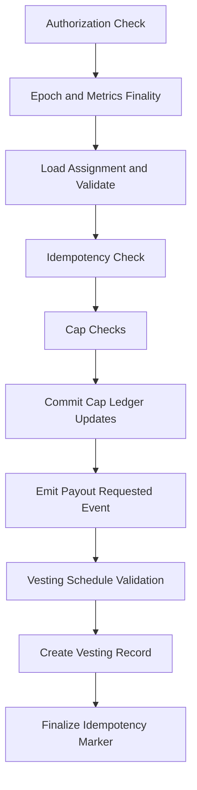

# Other — treasuryKernel

# TreasuryKernel Module Documentation

## Overview

The **TreasuryKernel** module is a critical component of the CBE Compensation DAO, responsible for managing the treasury payout flow and ensuring compliance with defined compensation policies. This module enforces strict rules around role definitions, assignments, and cap management, ensuring that payouts are executed securely and transparently.

## Purpose

The primary purpose of the TreasuryKernel module is to facilitate the payout process for compensation roles while adhering to a stable set of data schemas and operational flows. It ensures that all payouts are authorized, validated, and recorded according to the established rules, thereby maintaining the integrity of the compensation system.

## Key Components

### 1. Core Data Schemas

The TreasuryKernel relies on a set of stable data schemas that define the structure and rules for compensation roles and assignments. These schemas include:

- **RoleDefinition**: Defines the compensation policies for roles, including caps and active status.
- **Assignment**: Binds a role to a principal, tracking the validity period and suspension status.
- **CapLedger**: Monitors the spent values for cap enforcement across different scopes (GlobalPool, Role, Assignment).
- **ReasonCode**: An enum that categorizes the reasons for payouts, replacing free-text fields with immutable values.
- **Event Enums**: Defines events that capture changes in roles, assignments, and financial transactions.

### 2. Treasury.request_payout() Flow

The `request_payout()` function is the core method for initiating a payout. It follows a strict sequence of steps to ensure compliance and security:

1. **Authorization and Pause Check**: Validates that the caller is authorized and that the treasury is not paused.
2. **Epoch and Metrics Finality**: Ensures that the epoch is closed and metrics are finalized.
3. **Assignment Validation**: Checks the existence and status of the assignment.
4. **Idempotency Check**: Prevents duplicate payouts for the same assignment in the same epoch.
5. **Cap Checks**: Validates that the payout does not exceed defined caps.
6. **Cap Ledger Updates**: Updates the CapLedger and emits relevant events.
7. **Event Emission**: Emits a `PayoutRequested` event to document the payout request.
8. **Vesting Schedule Validation**: Ensures the proposed vesting schedule adheres to policy requirements.
9. **Vesting Record Creation**: Creates a vesting record and emits a `VestingCreated` event.
10. **Idempotency Marker Finalization**: Marks the payout as completed if all steps succeed.

### 3. Assignment-Level Cap Snapshots

When an assignment is created, it captures immutable ceilings for annual and lifetime caps. This mechanism prevents retroactive changes from affecting existing obligations and ensures that governance policy changes apply only to new assignments.

### 4. Contract Interface Expectations

The TreasuryKernel interacts with several other components in the system, including:

- **Role Registry**: Provides access to role definitions and assignments.
- **Metric Book**: Supplies finalized metrics and epoch parameters.
- **Epoch Clock**: Manages epoch states and numbering.
- **Compensation Engine**: Handles payout computations and maintains a ledger of paid assignments.

## Execution Flow

The execution flow of the `request_payout()` function is linear and strictly enforced. Below is a simplified representation of the flow:

## Conclusion

The TreasuryKernel module is a foundational element of the CBE Compensation DAO, ensuring that treasury payouts are executed in a secure, compliant, and auditable manner. By adhering to strict schemas and operational flows, it maintains the integrity of the compensation system and protects against potential vulnerabilities. Developers contributing to this module should familiarize themselves with the defined schemas, the payout flow, and the interactions with other components to ensure seamless integration and functionality.