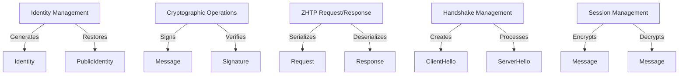

# Other — uniffi

# ZHTP Client Library Documentation

## Overview

The **ZHTP Client Library** is a Rust-based module designed to facilitate secure communication using the ZHTP protocol. It provides a set of identity management and cryptographic functions, enabling developers to create, manage, and utilize identities securely on iOS and Android platforms through generated Swift and Kotlin bindings. The library ensures that sensitive operations, such as key generation and signing, are performed locally, maintaining the privacy and security of user data.

## Purpose

The primary purpose of the ZHTP Client Library is to:
- Generate and manage cryptographic identities.
- Facilitate secure message signing and verification.
- Handle serialization and deserialization of requests and responses in the ZHTP protocol.
- Provide low-level cryptographic functions for encryption, decryption, and hashing.

## Key Components

### 1. Identity Management

The library provides functions to create and manage identities, which are crucial for secure communication. The `Identity` and `PublicIdentity` data types encapsulate the necessary information.

- **Functions:**
  - `generate_identity(string device_id)`: Generates a new identity with post-quantum keys.
  - `restore_identity_from_seed(sequence<u8> master_seed, string device_id)`: Restores an identity from a master seed.
  - `get_public_identity([ByRef] Identity identity)`: Extracts the public portion of an identity.
  - `serialize_identity([ByRef] Identity identity)`: Serializes an identity to JSON for storage.
  - `deserialize_identity(string json)`: Deserializes an identity from JSON.

### 2. Cryptographic Operations

The library includes several cryptographic functions that are essential for secure communication.

- **Functions:**
  - `sign_message([ByRef] Identity identity, sequence<u8> message)`: Signs an arbitrary message.
  - `verify_signature(sequence<u8> public_key, sequence<u8> message, sequence<u8> signature)`: Verifies a given signature.
  - `encrypt_oneshot(sequence<u8> key, sequence<u8> plaintext)`: Encrypts data using a one-shot encryption method.
  - `decrypt_oneshot(sequence<u8> key, sequence<u8> ciphertext)`: Decrypts data that was encrypted with the one-shot method.

### 3. ZHTP Request/Response Handling

The library provides functions to serialize and deserialize ZHTP requests and responses, which are essential for communication over the protocol.

- **Functions:**
  - `serialize_request([ByRef] ZhtpRequest request)`: Serializes a ZHTP request to CBOR bytes.
  - `deserialize_response(sequence<u8> data)`: Deserializes a ZHTP response from CBOR bytes.
  - `create_zhtp_frame(sequence<u8> payload)`: Creates a ZHTP wire frame from a payload.
  - `parse_zhtp_frame(sequence<u8> data)`: Parses a ZHTP wire frame and extracts the payload.

### 4. Handshake and Session Management

The library includes interfaces for managing handshake states and encrypted sessions, which are critical for establishing secure communication channels.

- **Interfaces:**
  - `HandshakeState`: Manages the handshake process, including creating and processing messages.
    - `create_client_hello()`: Creates the initial ClientHello message.
    - `process_server_hello(sequence<u8> data)`: Processes the ServerHello message and prepares the ClientFinish.
    - `finalize()`: Finalizes the handshake and retrieves the session key.
  - `Session`: Manages an encrypted session for authenticated communication.
    - `encrypt(sequence<u8> plaintext)`: Encrypts a message for secure transmission.
    - `decrypt(sequence<u8> ciphertext)`: Decrypts a received message.

### 5. Error Handling

The library defines a `ClientError` enum to handle various error scenarios, ensuring that developers can manage exceptions effectively.

- **Error Types:**
  - `CryptoError`
  - `HandshakeError`
  - `SerializationError`
  - `InvalidSignature`
  - `SessionExpired`
  - `InvalidFormat`
  - `IdentityError`
  - `KeyDerivationError`

## Execution Flow

The ZHTP Client Library does not have any internal or outgoing calls, and it operates independently. The execution flow is primarily driven by the functions invoked by the client application, which will utilize the provided APIs to manage identities, perform cryptographic operations, and handle ZHTP communication.

## Architecture Diagram

The following diagram illustrates the key components and their interactions within the ZHTP Client Library:

## Conclusion

The ZHTP Client Library is a robust solution for developers looking to implement secure communication in their applications. By leveraging its identity management, cryptographic functions, and ZHTP handling capabilities, developers can ensure that their applications maintain high security standards while providing a seamless user experience.