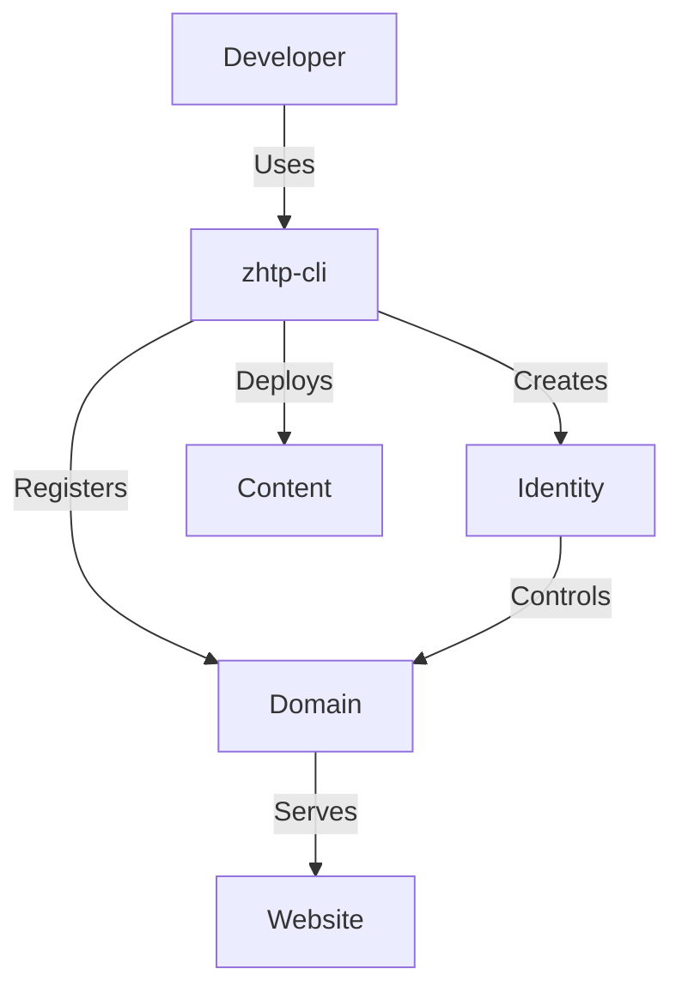

# Other — web4_deployment

# WEB4 Deployment Module Documentation

The **web4_deployment** module is designed to facilitate the deployment of websites to the Sovereign Network using a single identity model. This documentation provides a comprehensive overview of the module's purpose, key components, and operational workflows, enabling developers to understand and contribute effectively.

## Overview

The web4_deployment module allows developers to manage `.sov` domains, including creating identities, registering domains, and deploying content. The module emphasizes security and simplicity, relying on a single identity (DID) for domain ownership and deployment authority.

### Key Features

- **Domain Lifecycle Management**: Create, inspect, update, and renew `.sov` domains.
- **CI/CD Integration**: Seamlessly deploy websites using GitHub Actions.
- **Security Model**: Control over the domain is tied to the identity keystore, ensuring that only authorized users can deploy content.

## Architecture

The architecture of the web4_deployment module is centered around the `zhtp-cli` command-line interface, which interacts with the Sovereign Network. The following diagram illustrates the primary components and their interactions:



## Components

### 1. Identity Management

The identity management component allows users to create and manage their identities, which are essential for domain ownership and deployment.

#### Create Identity

To create an identity, use the following command:

```bash
zhtp-cli identity create --keystore ~/.zhtp/keystore
```

This command generates a new identity and stores it in the specified keystore.

#### Show Identity

To view the created identity, run:

```bash
zhtp-cli identity show --keystore ~/.zhtp/keystore
```

### 2. Domain Management

The domain management component handles the lifecycle of `.sov` domains.

#### Register Domain

To register a new domain, execute:

```bash
zhtp-cli domain register your-site.sov --keystore ~/.zhtp/keystore
```

This command registers the specified domain under the created identity.

#### View Domain Information

To inspect domain details, use:

```bash
zhtp-cli domain info your-site.sov --keystore ~/.zhtp/keystore
```

This command displays ownership and metadata associated with the domain.

#### Renew Domain

To extend the expiration of a domain, run:

```bash
zhtp-cli domain renew your-site.sov --keystore ~/.zhtp/keystore
```

#### Update Domain Records

To update domain records, such as content hash, use:

```bash
zhtp-cli domain update your-site.sov --content-hash <CID> --keystore ~/.zhtp/keystore
```

### 3. Deployment

The deployment component allows users to deploy their websites to the Sovereign Network.

#### Deployment Modes

The module supports two deployment modes:

- **Static**: For plain HTML/CSS sites.
- **SPA**: For single-page applications that require client-side routing.

#### Example Deployment Command

To deploy a static site, use:

```bash
zhtp-cli deploy --domain your-site.sov --path dist --mode static
```

For a single-page application, the command would be:

```bash
zhtp-cli deploy --domain your-site.sov --path dist --mode spa
```

## CI/CD Integration

The web4_deployment module is designed to work seamlessly with CI/CD pipelines, particularly GitHub Actions. Developers can automate the deployment process by configuring GitHub Actions workflows.

### Required Secrets

To enable CI/CD deployment, the following secrets must be configured in the GitHub repository:

| Secret | Purpose |
|--------|---------|
| `ZHTP_KEYSTORE_B64` | Base64-encoded identity keystore |
| `ZHTP_SERVER` | Network endpoint for deployment |
| `ZHTP_SERVER_SPKI` | TLS pin for secure connections |

### Example GitHub Actions Workflow

Here is a minimal example of a GitHub Actions workflow for deploying a static site:

```yaml
name: Deploy to Sovereign Network

on:
  push:
    branches: ["main"]

jobs:
  deploy:
    runs-on: ubuntu-latest

    steps:
      - uses: actions/checkout@v4
      - uses: actions/setup-node@v4
        with:
          node-version: "20"
      - run: npm run build
      - run: |
          curl -L https://github.com/SOVEREIGN-NET/The-Sovereign-Network/releases/latest/download/zhtp-cli-linux-x86_64.tar.gz -o zhtp-cli.tar.gz
          tar -xzf zhtp-cli.tar.gz
          sudo mv zhtp-cli /usr/local/bin/
      - env:
          ZHTP_KEYSTORE_B64: ${{ secrets.ZHTP_KEYSTORE_B64 }}
          ZHTP_SERVER: ${{ secrets.ZHTP_SERVER }}
          ZHTP_SERVER_SPKI: ${{ secrets.ZHTP_SERVER_SPKI }}
        run: |
          mkdir -p ~/.zhtp
          echo "$ZHTP_KEYSTORE_B64" | base64 -d | tar -xzf - -C ~/.zhtp
          zhtp-cli deploy --domain your-site.sov --keystore ~/.zhtp/keystore --mode static --path dist/
```

## Security Considerations

- **Keystore Protection**: The keystore contains full authority over the domain. It must be protected as a sensitive asset.
- **CI/CD Trust**: The CI/CD pipeline is trusted because it uses the keystore. Ensure that only authorized personnel have access to the repository and its secrets.
- **Base64 Encoding**: Base64 encoding is not encryption. Treat the keystore with the same care as a private key.

## Conclusion

The web4_deployment module provides a robust framework for managing `.sov` domains and deploying websites to the Sovereign Network. By following the guidelines and examples provided in this documentation, developers can effectively utilize the module to create, manage, and deploy their web applications securely.