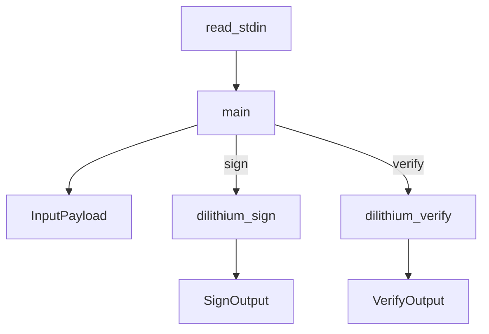

# Other — zhtp-dilithium-signer

# zhtp-dilithium-signer Module Documentation

## Overview

The `zhtp-dilithium-signer` module is a command-line tool designed for signing and verifying messages using the Dilithium post-quantum cryptographic algorithm. It leverages the `lib-crypto` library for the underlying cryptographic operations and utilizes `serde` for JSON serialization and deserialization. The module reads input from standard input, processes it based on the specified mode (either "sign" or "verify"), and outputs the result in JSON format.

## Purpose

The primary purpose of this module is to provide a simple interface for signing messages with a secret key and verifying signatures with a public key. This is particularly useful in scenarios where secure communication is required, and the integrity of messages must be ensured against potential quantum attacks.

## Key Components

### 1. Input and Output Structures

The module defines two main data structures for handling input and output:

- **InputPayload**: This struct is used to deserialize the input JSON payload. It contains the following fields:
  - `mode`: A string indicating the operation mode ("sign" or "verify").
  - `message_b64`: The base64-encoded message to be signed or verified.
  - `dilithium_sk_b64`: (Optional) The base64-encoded secret key for signing.
  - `dilithium_pk_b64`: (Optional) The base64-encoded public key for verification.
  - `signature_b64`: (Optional) The base64-encoded signature for verification.

- **SignOutput**: This struct is used to serialize the output of the signing operation, containing:
  - `signature_b64`: The base64-encoded signature.

- **VerifyOutput**: This struct is used to serialize the output of the verification operation, containing:
  - `valid`: A boolean indicating whether the signature is valid.

### 2. Main Functionality

The core functionality of the module is encapsulated in the `main` function, which orchestrates the signing and verification processes based on the input mode. The execution flow is as follows:

1. **Read Input**: The `read_stdin` function reads the entire input from standard input and returns it as a string. If the input is empty, it returns an error.

2. **Deserialize Input**: The input string is deserialized into an `InputPayload` struct using `serde_json`.

3. **Process Mode**:
   - **Sign Mode**:
     - The secret key and message are decoded from base64.
     - The `dilithium_sign` function is called to generate a signature.
     - The signature is then encoded back to base64 and returned as a JSON response.
   - **Verify Mode**:
     - The public key, message, and signature are decoded from base64.
     - The `dilithium_verify` function is called to check the validity of the signature.
     - The result (true or false) is returned as a JSON response.

4. **Error Handling**: The module uses the `anyhow` crate for error handling, providing descriptive error messages for missing fields or unknown modes.

### 3. Dependencies

The module relies on several external crates:
- `anyhow`: For error handling.
- `base64`: For encoding and decoding base64 strings.
- `serde` and `serde_json`: For serialization and deserialization of JSON data.
- `lib-crypto`: A local dependency that provides the `dilithium_sign` and `dilithium_verify` functions.

## Execution Flow

The following diagram illustrates the execution flow of the `zhtp-dilithium-signer` module:

## How to Contribute

To contribute to the `zhtp-dilithium-signer` module, follow these steps:

1. **Clone the Repository**: Clone the repository containing the module.
2. **Install Dependencies**: Run `cargo build` to install the necessary dependencies.
3. **Run Tests**: Ensure that existing tests pass by running `cargo test`.
4. **Implement Changes**: Make your changes or add new features.
5. **Submit a Pull Request**: Once your changes are complete, submit a pull request for review.

## Conclusion

The `zhtp-dilithium-signer` module provides a straightforward interface for signing and verifying messages using post-quantum cryptography. By understanding its structure and functionality, developers can effectively contribute to its development and enhance its capabilities.