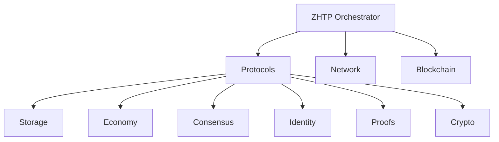

# Other — zhtp

# ZHTP Module Documentation

## Overview

The **ZHTP** (Zero-Knowledge Hypertext Transfer Protocol) module serves as a network node designed to orchestrate a complete internet replacement system. It leverages a mesh networking architecture to provide decentralized communication, ensuring zero-knowledge privacy, universal basic income (UBI) distribution, and post-quantum security. This module is a critical component of the Sovereign Network, integrating various specialized libraries to achieve its goals.

## Purpose

ZHTP aims to replace traditional internet infrastructure with a decentralized, privacy-focused alternative. It facilitates peer-to-peer communication through multiple protocols, including Bluetooth LE, WiFi Direct, and LoRaWAN, while ensuring that all communications are secure and private.

## Architecture

The ZHTP module operates as a **Level 1 Orchestrator**, coordinating various **Level 2 Components**. The architecture is designed to be modular, allowing for easy integration and management of different functionalities.



### Key Components

1. **Protocols**: Implements high-level protocol definitions and interactions.
2. **Network**: Manages mesh networking capabilities, including peer discovery and connection management.
3. **Blockchain**: Integrates blockchain functionalities, including UBI distribution and transaction validation.
4. **Storage**: Handles distributed storage solutions with encryption.
5. **Economy**: Manages economic incentives and DAO governance mechanisms.
6. **Consensus**: Implements consensus algorithms for transaction validation and network integrity.
7. **Identity**: Provides privacy-preserving identity management.
8. **Proofs**: Implements zero-knowledge proof systems for transaction validation.
9. **Crypto**: Manages cryptographic operations, including post-quantum algorithms.

## Core Modules

### Configuration System (`src/config/`)

- **aggregation.rs**: Coordinates configurations across packages.
- **validation.rs**: Detects and resolves configuration conflicts.
- **environment.rs**: Manages environment-specific settings (dev/staging/prod).
- **mesh_modes.rs**: Manages different mesh networking modes.
- **security.rs**: Configures security levels.

### CLI Interface (`src/cli/`)

- **argument_parsing.rs**: Processes command-line arguments.
- **command_execution.rs**: Handles command execution and orchestration.
- **interactive_shell.rs**: Provides an interactive shell with auto-completion.
- **commands/**: Contains specialized command handlers for each subsystem.

### Runtime Orchestration (`src/runtime/`)

- **components.rs**: Manages the lifecycle of components.
- **blockchain_provider.rs**: Integrates with the blockchain layer.
- **shared_blockchain.rs**: Manages shared blockchain state.

### Monitoring System (`src/monitoring/`)

- **metrics.rs**: Collects real-time system metrics.
- **health_check.rs**: Monitors the health of components.
- **alerting.rs**: Manages alerts and notifications.
- **dashboard.rs**: Provides a web dashboard for live visualization.

### Integration Layer (`src/integration/`)

- **service_container.rs**: Implements a dependency injection container.
- **event_bus.rs**: Manages inter-component messaging.
- **component_manager.rs**: Coordinates component startup and shutdown.
- **dependency_injection.rs**: Resolves dependencies.

### API Server (`src/api/`)

- **server.rs**: Implements the HTTP API server for external integrations.
- **endpoints.rs**: Defines RESTful API endpoints.
- **handlers/**: Contains request handlers for various functional areas.

## Getting Started

### Prerequisites

1. **Rust 1.70+**: Install from [rustup.rs](https://rustup.rs/).
2. **ZHTP Libraries**: Ensure all required `lib-*` packages are available in the parent directory.
3. **System Requirements**: Minimum of 4GB RAM and 10GB storage.

### Installation Steps

1. **Clone the Repository**:
   ```bash
   git clone https://github.com/SOVEREIGN-NET/SOVEREIGN_NET.git
   cd SOVEREIGN_NET/zhtp
   ```

2. **Verify Dependencies**:
   ```bash
   ls -la ../lib-*
   ```

3. **Build the ZHTP Node**:
   ```bash
   cargo build --release
   ```

4. **Run Initial Setup**:
   ```bash
   cargo run -- node start --dev
   ```

### Quick Start

#### Interactive CLI Mode (Recommended)
```bash
cargo run
```
- Use commands like `node start`, `wallet create`, and `dao info` to interact with the system.

#### Direct Commands
```bash
cargo run -- node start --config config.toml
```

## Configuration

### Default Configuration File (`lib-node.toml`)
The default configuration file defines various settings for the ZHTP node, including node name, mesh port, security levels, and economic parameters.

### Environment Variables
You can set environment variables to customize the configuration:
```bash
export ZHTP_CONFIG_PATH="./config.toml"
export ZHTP_DATA_DIR="./data"
export ZHTP_LOG_LEVEL="info"
```

## Monitoring & Debugging

### Web Dashboard
Access the monitoring dashboard at `http://127.0.0.1:9334` to view system metrics, component health, and network statistics.

### Log Files
Logs are stored in `./logs/zhtp.log`. You can view them using:
```bash
tail -f ./logs/zhtp.log
```

### Health Checks
Perform health checks via the CLI:
```bash
zhtp-cli network status
```

## Development

### Building from Source
```bash
cargo build
cargo build --release
```

### Running Tests
```bash
cargo test
```

### Development Mode
Start the node in development mode with enhanced logging:
```bash
cargo run -- node start --dev
```

## Security Features

### Post-Quantum Cryptography
Utilizes CRYSTALS-Dilithium and CRYSTALS-Kyber for secure communications.

### Zero-Knowledge Privacy
Implements Plonky2 proofs for privacy-preserving transaction validation.

### Economic Security
Incorporates anti-spam measures and quality-based rewards to ensure network integrity.

## Conclusion

The ZHTP module is a robust and modular system designed to provide a decentralized internet replacement. By leveraging advanced cryptographic techniques and a flexible architecture, it aims to create a secure and private communication environment. Developers are encouraged to contribute to the project and explore its capabilities further. For more information, refer to the [documentation](https://docs.zhtp.org) and the [GitHub repository](https://github.com/zhtp/zhtp).