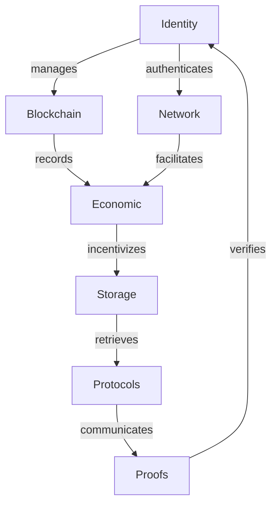

# The-Sovereign-Network — Wiki

# Welcome to The Sovereign Network Wiki

Welcome to the **Sovereign Network**! This repository is a comprehensive monorepo containing all the Rust code necessary to build and run ZHTP (Zero-Knowledge Hypertext Transfer Protocol) orchestrator nodes. Our goal is to create a decentralized network that prioritizes privacy, security, and economic sustainability.

## Project Overview

The Sovereign Network is designed to facilitate secure, efficient, and decentralized interactions across various applications. At its core, the network leverages a unique identity architecture that is seed-anchored, ensuring that all identity components derive from a single root of trust. This architecture supports a range of functionalities, including decentralized identity management, blockchain operations, and economic transactions.

### Key Features

- **Decentralized Identity Management**: The [Identity](identity.md) module allows for the creation and management of decentralized identities (DIDs) using quantum-resistant cryptography.
- **Blockchain Functionality**: The [Blockchain](blockchain.md) module provides the framework for creating, validating, and managing blockchain data structures.
- **Economic Framework**: The [Economy](economy.md) module implements a post-scarcity economic model, facilitating transactions and resource distribution.
- **Networking Capabilities**: The [Network](network.md) module enables decentralized mesh networking for peer-to-peer communication.
- **Zero-Knowledge Proofs**: The [Proofs](proofs.md) module offers tools for generating and verifying zero-knowledge proofs, enhancing privacy across transactions.

## Architecture Overview

The architecture of The Sovereign Network is designed to be modular and scalable. Below is a high-level overview of the key modules and their relationships:



## Getting Started

To get started with The Sovereign Network, follow these steps:

1. **Clone the Repository**: 
   ```bash
   git clone https://github.com/your-org/The-Sovereign-Network.git
   cd The-Sovereign-Network
   ```

2. **Set Up Your Environment**: Ensure you have Rust installed. You can install Rust using [rustup](https://rustup.rs/).

3. **Build the Project**: 
   ```bash
   cargo build
   ```

4. **Run Tests**: 
   ```bash
   cargo test
   ```

5. **Explore the Modules**: Dive into the specific modules like [lib-tokens](lib-tokens.md), [lib-governance](lib-governance.md), and others to understand their functionalities and how they contribute to the overall architecture.

## Conclusion

We are excited to have you on board! The Sovereign Network is a collaborative effort, and your contributions can help shape the future of decentralized interactions. For more detailed information on each module, please explore the links provided throughout this overview. If you have any questions or need assistance, feel free to reach out to the community. Happy coding!