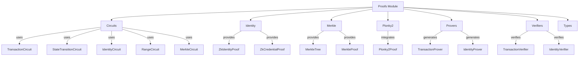

# Proofs — src

# Proofs Module Documentation

## Overview

The **Proofs** module is a core component of the zero-knowledge (ZK) proof system, designed to facilitate the creation, verification, and management of various types of zero-knowledge proofs. This module encompasses a range of functionalities, including transaction validation, identity verification, range proofs, and Merkle tree operations. It is structured to provide high-performance implementations and optimized algorithms for each proof type.

## Purpose

The primary purpose of the Proofs module is to enable developers to implement and utilize zero-knowledge proofs in their applications. This allows for secure and private transactions, identity verification, and data integrity checks without revealing sensitive information. The module is designed to be extensible, allowing for the addition of new proof types and functionalities as needed.

## Key Components

The Proofs module is organized into several sub-modules, each responsible for a specific aspect of zero-knowledge proofs. Below is a breakdown of the key components:

### 1. Circuits

The `circuits` module contains implementations of various circuits used in zero-knowledge proofs. Each circuit is tailored for a specific proof type:

- **TransactionCircuit**: Handles the logic for validating transactions.
- **StateTransitionCircuit**: Manages state transitions in a blockchain context.
- **IdentityCircuit**: Facilitates identity verification.
- **RangeCircuit**: Implements range proofs to verify that a value lies within a specified range.
- **MerkleCircuit**: Supports operations related to Merkle trees.

### 2. Identity

The `identity` module provides functionalities for identity verification through zero-knowledge proofs:

- **ZkIdentityProof**: Represents a proof of identity.
- **ZkCredentialProof**: Represents a proof of possession of specific credentials.
- **Verification Functions**: Includes functions like `verify_identity_proof` and `verify_credential_proof` to validate proofs.

### 3. Merkle

The `merkle` module focuses on Merkle tree operations, which are essential for efficient proof generation and verification:

- **Tree Construction**: Functions to build Merkle trees.
- **Proof Generation**: Methods to generate inclusion proofs.
- **Verification**: Functions to verify Merkle proofs without revealing the tree structure.

### 4. Plonky2

The `plonky2` module integrates high-performance recursive SNARK implementations using the Plonky2 framework:

- **ZkProofSystem**: Represents the proof system.
- **CircuitBuilder**: A builder for constructing circuits.
- **Verification Functions**: Includes `verify_plonky2_proof` for validating proofs generated by Plonky2.

### 5. Provers

The `provers` module contains specialized provers for generating zero-knowledge proofs:

- **TransactionProver**: Prover for transaction-related proofs.
- **IdentityProver**: Prover for identity-related proofs.
- **RangeProver**: Prover for range proofs.
- **MerkleProver**: Prover for Merkle tree proofs.

### 6. Verifiers

The `verifiers` module provides specialized verifiers for validating zero-knowledge proofs:

- **TransactionVerifier**: Verifies transaction proofs.
- **IdentityVerifier**: Verifies identity proofs.
- **RangeVerifier**: Verifies range proofs.
- **MerkleVerifier**: Verifies Merkle proofs.
- **RecursiveProofAggregator**: Aggregates recursive proofs for batch verification.

### 7. Types

The `types` module defines core types and structures used throughout the proof system:

- **ZkProof**: Base structure for zero-knowledge proofs.
- **MerkleProof**: Structure for Merkle proofs.
- **VerificationResult**: Represents the result of a verification operation.

## Architecture Overview

The following diagram illustrates the relationships between the main components of the Proofs module:

## How It Works

The Proofs module operates by allowing developers to create circuits that define the logic of the proof they wish to generate. Each circuit is instantiated with specific parameters and inputs, and the corresponding prover is used to generate the proof. Once generated, the proof can be verified using the appropriate verifier, ensuring that the proof is valid without revealing any underlying sensitive data.

### Example Usage

To create a transaction proof, a developer would typically follow these steps:

1. **Instantiate the TransactionCircuit** with the necessary inputs.
2. **Use the TransactionProver** to generate a proof based on the circuit.
3. **Verify the proof** using the TransactionVerifier to ensure its validity.

## Conclusion

The Proofs module is a comprehensive framework for implementing zero-knowledge proofs in various contexts. Its modular design allows for easy extension and integration with other components of the codebase, making it a powerful tool for developers working on privacy-preserving applications. By leveraging the specialized circuits, provers, and verifiers, developers can efficiently create and validate proofs while maintaining the integrity and confidentiality of sensitive information.