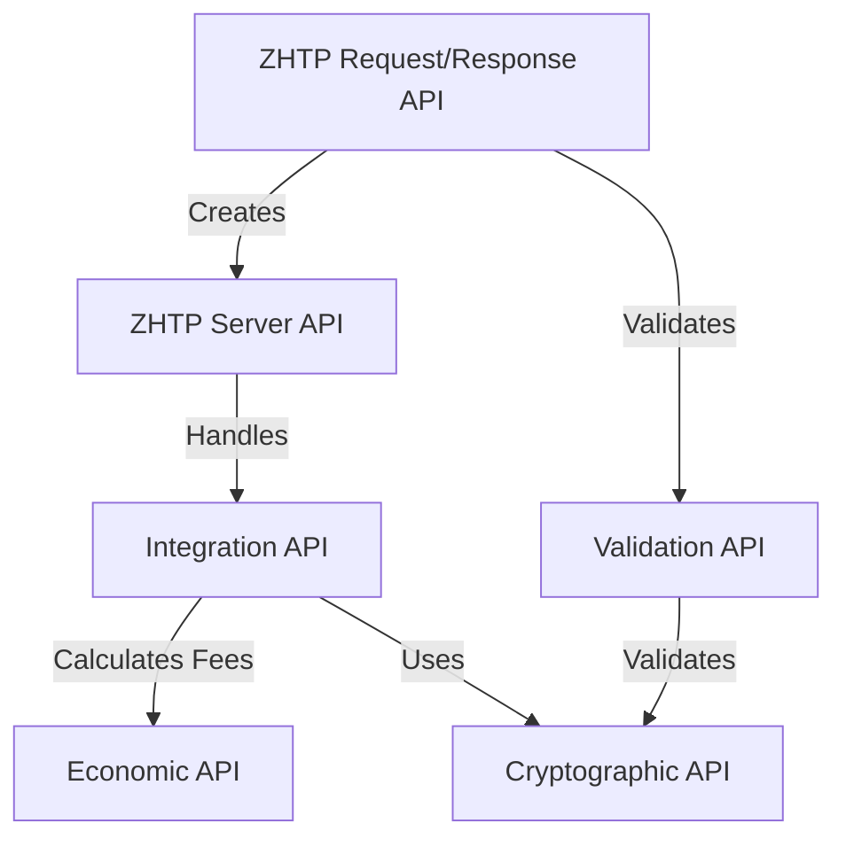

# Protocols — docs

# Protocols Module Documentation

The **Protocols** module of the `lib-protocols` library implements the core functionalities of the Zero Knowledge Hypertext Transfer Protocol (ZHTP) and the Zero Knowledge Domain Name System (ZDNS). This module serves as the backbone for the Web4 architecture, providing essential APIs for request/response handling, server management, validation, integration, economic calculations, and cryptographic operations.

## Overview

The Protocols module is designed to facilitate secure, efficient, and privacy-preserving communication over the internet. It leverages zero-knowledge proofs to ensure that sensitive information is not exposed during transactions. The module is composed of several key components, each responsible for specific functionalities.

### Key Components

1. **ZHTP Request/Response API**: Handles the creation and management of HTTP-like requests and responses.
2. **ZHTP Server API**: Manages the server lifecycle, including starting, stopping, and handling requests.
3. **ZDNS API**: Provides domain name resolution services with zero-knowledge proofs.
4. **Validation API**: Validates requests, responses, and cryptographic proofs.
5. **Integration API**: Orchestrates interactions between various components of the protocol stack.
6. **Economic API**: Calculates fees and validates economic requirements for operations.
7. **Cryptographic API**: Manages cryptographic operations, including key generation and proof verification.

## Architecture

The following diagram illustrates the high-level architecture of the Protocols module, highlighting the relationships between its key components:



## Detailed Component Descriptions

### 1. ZHTP Request/Response API

The ZHTP Request/Response API provides structures and methods for creating and managing requests and responses.

#### Key Structures

- **ZhtpRequest**: Represents an incoming request with fields for method, URI, headers, body, and optional authentication proof.
- **ZhtpResponse**: Represents an outgoing response with fields for status, headers, body, and optional validity proof.

#### Example Usage

```rust
let request = ZhtpRequest::new(ZhtpMethod::Get, "/api/data", "1.1", headers, body);
let response = ZhtpResponse::new(ZhtpStatus::Ok, response_body);
```

### 2. ZHTP Server API

The ZHTP Server API manages the lifecycle of the server, including starting and stopping it, as well as registering request handlers and middleware.

#### Key Methods

- `new(config: ServerConfig)`: Initializes a new server instance.
- `start()`: Starts the server and begins listening for incoming requests.
- `stop()`: Stops the server gracefully.
- `register_handler<H: ZhtpRequestHandler>(&mut self, handler: H)`: Registers a handler for processing requests.

#### Example Usage

```rust
let config = ServerConfig { /* configuration fields */ };
let server = ZhtpServer::new(config);
server.start().await?;
```

### 3. ZDNS API

The ZDNS API provides functionalities for domain name resolution and management.

#### Key Methods

- `new(config: ZdnsConfig)`: Creates a new ZDNS server instance.
- `resolve(query: ZdnsQuery)`: Resolves a domain query and returns a response.

#### Example Usage

```rust
let query = ZdnsQuery { name: "example.zhtp".to_string(), record_type: ZdnsRecordType::A, recursive: true };
let response = zdns_server.resolve(query).await?;
```

### 4. Validation API

The Validation API ensures that requests and responses conform to the expected formats and validates cryptographic proofs.

#### Key Methods

- `validate_request(&self, request: &ZhtpRequest)`: Validates the structure of a request.
- `validate_response(&self, response: &ZhtpResponse)`: Validates the structure of a response.

#### Example Usage

```rust
let validator = ZhtpValidator::new(ValidationConfig::default());
let validation_result = validator.validate_request(&request).await?;
```

### 5. Integration API

The Integration API coordinates the processing of requests across different components of the protocol stack.

#### Key Methods

- `new(config: IntegrationConfig)`: Initializes a new integrated system.
- `process_integrated_request(&mut self, request: ZhtpRequest)`: Processes a complete ZHTP request through all systems.

#### Example Usage

```rust
let integration = ZhtpIntegration::new(IntegrationConfig::default()).await?;
let response = integration.process_integrated_request(request).await?;
```

### 6. Economic API

The Economic API calculates fees associated with operations and validates economic requirements.

#### Key Methods

- `calculate_operation_fees(&self, operation_type: &str, data_size: usize, priority: Priority)`: Calculates fees for a given operation.

#### Example Usage

```rust
let fees = econ.calculate_operation_fees("POST", 2048, Priority::Normal)?;
```

### 7. Cryptographic API

The Cryptographic API provides methods for cryptographic operations, including key generation and proof verification.

#### Key Methods

- `generate_keypair()`: Generates a new cryptographic keypair.
- `verify_protocol_signature(&self, data: &[u8], signature: &PostQuantumSignature, public_key: &[u8])`: Verifies a signature.

#### Example Usage

```rust
let crypto = ZhtpCrypto::new()?;
let valid = crypto.verify_protocol_signature(&data, &sig, &pubkey)?;
```

## Common Patterns

### Request-Response Handling

The following pattern illustrates how to handle a ZHTP request and generate a response:

```rust
async fn handle_request(request: ZhtpRequest) -> ZhtpResult<ZhtpResponse> {
    let validator = ZhtpValidator::new(ValidationConfig::default());
    let validation = validator.validate_request(&request).await?;
    
    if !validation.valid {
        return Ok(ZhtpResponse::error(ZhtpStatus::BadRequest, "Invalid request"));
    }
    
    let econ = ZhtpEconomics::new(EconomicConfig::default())?;
    let fees = econ.calculate_operation_fees(request.method.as_str(), request.body.len(), Priority::Normal)?;
    
    let result = process_business_logic(&request).await?;
    
    Ok(ZhtpResponse::success(result))
}
```

### Full Integration Example

This example demonstrates how to set up and use the integrated system:

```rust
#[tokio::main]
async fn main() -> Result<()> {
    let integration = ZhtpIntegration::new(IntegrationConfig::default()).await?;
    let request = ZhtpRequest::new(...);
    let response = integration.process_integrated_request(request).await?;
    
    if response.status == ZhtpStatus::Ok {
        println!("Success!");
    }
    
    Ok(())
}
```

## Error Handling

All functions in the Protocols module return `Result` types, allowing for robust error handling. The `ProtocolError` enum defines various error types that can occur during operations.

### Example Error Handling

```rust
match integration.process_integrated_request(request).await {
    Ok(response) => println!("Success: {:?}", response),
    Err(e) => eprintln!("Error: {}", e),
}
```

## Conclusion

The Protocols module is a critical component of the `lib-protocols` library, providing the necessary tools for building secure and efficient applications on the Web4 architecture. By leveraging zero-knowledge proofs and a robust request/response model, developers can create applications that prioritize user privacy and security. For further details, refer to the individual component documentation and examples provided in the library.