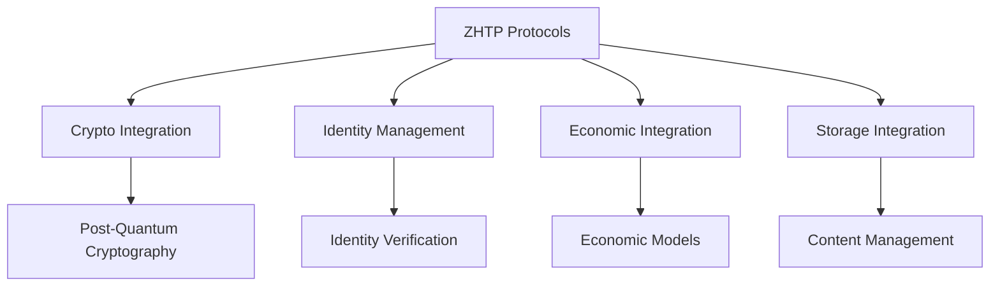

# Protocols — src

# Protocols Module Documentation

## Overview

The **Protocols** module is a comprehensive implementation of the ZHTP (Zero Knowledge Hypertext Transfer Protocol) and related protocols designed for the Web4 ecosystem. This module integrates various components such as cryptography, identity management, economic incentives, and storage solutions to create a secure, efficient, and decentralized communication framework.

### Key Features
- **Zero-Knowledge Proofs**: Ensures privacy and security in transactions.
- **Post-Quantum Cryptography**: Utilizes advanced cryptographic techniques to secure communications against quantum attacks.
- **Economic Incentives**: Embeds economic models within the protocol to encourage participation and resource sharing.
- **Identity Management**: Integrates identity verification and management to ensure secure access and authentication.
- **Storage Integration**: Provides mechanisms for distributed content management and retrieval.

## Architecture

The architecture of the Protocols module is designed to facilitate seamless interaction between its various components. Below is a high-level overview of the architecture:

## Components

### 1. Cryptographic Integration (`crypto.rs`)

The cryptographic integration module provides essential cryptographic functions and utilities tailored for ZHTP protocols. It leverages the `lib_crypto` package for post-quantum cryptography.

#### Key Functions:
- **`new()`**: Initializes a new cryptographic context with a generated keypair.
- **`hash_content(data: &[u8])`**: Generates a hash for the provided data using the BLAKE3 hashing algorithm.
- **`verify_protocol_signature(...)`**: Verifies a signature against the provided data and public key.
- **`verify_zk_proof(...)`**: Validates zero-knowledge proofs using the `lib_proofs` package.

### 2. Identity Management (`identity.rs`)

This module serves as a bridge for integrating identity management functionalities with ZHTP protocols. It provides authentication, identity verification, and zero-knowledge identity proofs.

#### Key Functions:
- **`authenticate_request(...)`**: Authenticates an identity based on the provided ZHTP request.
- **`create_session(...)`**: Creates a new identity session based on authentication requests.
- **`get_session(...)`**: Retrieves an active identity session using a session token.

### 3. Economic Integration (`economics.rs`)

The economic integration module manages economic assessments and incentives within the ZHTP framework. It calculates fees and validates economic transactions.

#### Key Functions:
- **`calculate_operation_fees(...)`**: Computes the fees associated with a specific operation based on its parameters.
- **`validate_economic_requirements(...)`**: Ensures that the economic conditions for a transaction are met.

### 4. Storage Integration (`storage.rs`)

This module integrates with the `lib-storage` package to manage distributed content storage and retrieval. It provides mechanisms for storing, retrieving, and managing content.

#### Key Functions:
- **`store_content(...)`**: Stores content in the distributed storage system.
- **`retrieve_content(...)`**: Retrieves content based on its identifier.
- **`delete_content(...)`**: Deletes content from the storage system.

### 5. Integration Module (`integration.rs`)

The integration module orchestrates interactions between all components of the ZHTP protocol. It processes incoming requests and coordinates the necessary actions across the various subsystems.

#### Key Functions:
- **`process_integrated_request(...)`**: Handles a complete ZHTP request, validating cryptographic components, processing economic requirements, and managing storage operations.
- **`create_integrated_response(...)`**: Constructs a response based on the results of the integrated request processing.

## Execution Flow

The execution flow of the Protocols module can be summarized as follows:

1. **Request Handling**: An incoming ZHTP request is received by the integration module.
2. **Validation**: The request is validated for cryptographic integrity and economic requirements.
3. **Processing**: Depending on the request type (GET, POST, etc.), the appropriate actions are taken, which may involve:
   - Verifying signatures and zero-knowledge proofs.
   - Calculating economic fees.
   - Storing or retrieving content from the storage system.
4. **Response Generation**: An integrated response is created and sent back to the requester.

## Conclusion

The Protocols module is a critical component of the Web4 ecosystem, providing a robust framework for secure, decentralized communication. By integrating cryptographic, identity, economic, and storage functionalities, it enables a new paradigm of internet interaction that prioritizes privacy, security, and user empowerment. 

Developers looking to contribute to this module should familiarize themselves with the individual components and their interactions, as well as the overall architecture and execution flow. This understanding will facilitate effective enhancements and maintenance of the Protocols module.