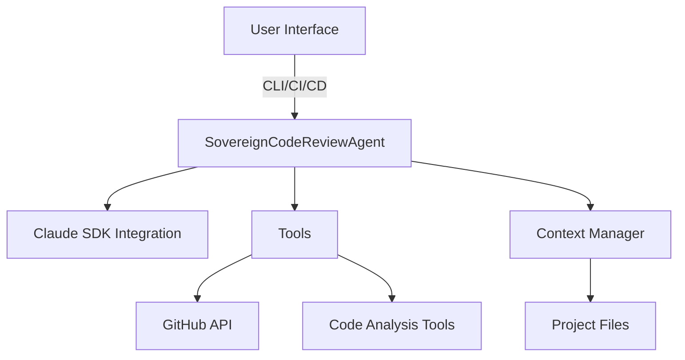

# Sovereign Code Reviewer

# Sovereign Code Reviewer Module Documentation

## Overview

The **Sovereign Code Reviewer** is an intelligent code review agent designed to automate and enhance the code review process for The Sovereign Network. It leverages context-aware analysis, prioritizes issues based on severity, and integrates seamlessly with GitHub for issue tracking and pull request comments. The agent is built using the Claude Agent SDK and is focused on security, architecture, and performance.

## Purpose

The primary goals of the Sovereign Code Reviewer are to:
- Automate code reviews with project-specific knowledge.
- Identify and classify issues based on their severity (P0-P3).
- Create GitHub issues and comments for identified problems.
- Continuously improve its review capabilities through self-analysis.

## Key Features

- **Architecture-Aware Reviews**: Understands the specific architecture of The Sovereign Network, including critical areas like `lib-identity` and `lib-proofs`.
- **Security-Focused Analysis**: Performs checks for cryptographic vulnerabilities, identity management issues, and zero-knowledge proof operations.
- **Issue Classification**: Classifies issues into categories (security, architecture, performance, etc.) and assigns priority levels (P0-P3).
- **GitHub Integration**: Automatically creates issues and comments on pull requests based on review findings.
- **Self-Improvement Reporting**: Tracks performance metrics and suggests improvements based on review history.

## Architecture

The architecture of the Sovereign Code Reviewer is designed to facilitate efficient code reviews while maintaining a clear separation of concerns. Below is a high-level overview of the architecture:



### Components

1. **SovereignCodeReviewAgent (`src/agent.py`)**
   - The main orchestrator of the code review process.
   - Manages interactions with the Claude API and coordinates tools and context.
   - Key methods include:
     - `review_file()`: Reviews a single file and returns findings.
     - `generate_self_improvement_report()`: Generates a report on the agent's performance.

2. **Project Context System (`src/context/project_context.py`)**
   - Maintains knowledge of the project's architecture, patterns, and rules.
   - Loads context from `architecture.yaml` and provides methods to retrieve relevant patterns and security rules.

3. **Issue Classification (`src/models/issue.py`)**
   - Defines the structure for issues identified during reviews.
   - Classifies issues based on priority and type, providing a clear format for reporting.

4. **GitHub Integration (`src/tools/github_integration.py`)**
   - Handles interactions with the GitHub API for creating issues and comments.
   - Formats issue bodies and determines appropriate labels based on the issue type.

5. **Review Results (`src/models/review.py`)**
   - Models the results of a code review, including a summary of issues found and performance metrics.

## How It Works

### Review Process

1. **Initialization**: The agent is initialized with the project root and optional configurations for GitHub integration.
2. **File Review**: When a file is reviewed, the agent:
   - Loads the file content.
   - Builds a context specific to the file, including relevant architecture patterns and security rules.
   - Calls the Claude API to analyze the code and identify issues.
3. **Issue Classification**: The identified issues are classified based on the project context, and priorities are assigned.
4. **GitHub Integration**: If configured, the agent creates GitHub issues for critical findings (P0/P1) and posts comments on pull requests.
5. **Self-Improvement**: The agent tracks its performance and generates reports to suggest improvements.

### Example Usage

#### Command Line Interface (CLI)

To review a single file:
```bash
python -m src.main review --file path/to/file.rs --create-issues
```

To review a pull request:
```bash
python -m src.main pr --number 123 --create-issues
```

#### Programmatic API

```python
from src.agent import SovereignCodeReviewAgent

agent = SovereignCodeReviewAgent(project_root="/path/to/project", create_github_issues=True)
result = agent.review_file("path/to/file.rs")

if result.has_blocking_issues():
    print("Critical issues found!")
```

## Integration Points

### Current Integrations
- **GitHub Issues**: Automatically creates issues for identified problems.
- **GitHub PR Comments**: Posts comments on pull requests with review findings.
- **CLI**: Provides a command-line interface for manual reviews.
- **Python API**: Allows programmatic access to the review functionality.

### Planned Integrations
- **Jira/Linear**: Sync issues with project management tools.
- **Slack/Discord**: Notifications for review results.
- **VS Code Extension**: Real-time feedback during development.

## Extensibility

### Adding New Patterns

To add new architectural patterns, modify the `architecture.yaml` file:
```yaml
patterns:
  - name: "New Pattern"
    description: "Description of the new pattern"
    examples:
      - "path/to/example.rs"
    rules:
      - "Rule 1"
      - "Rule 2"
```

### Adding New Review Rules

To implement a new review rule:
```python
@register_rule(priority="P1", category="security")
def check_custom_rule(code: str) -> list[Issue]:
    # Rule implementation
    pass
```

## Performance Characteristics

- **Review Speed**: 
  - Single File: 2-5 seconds
  - PR (10 files): 30-60 seconds
  - Full Scan (100 files): 5-10 minutes
- **Accuracy**: High detection rates for security and architectural issues.
- **Scalability**: Capable of parallel processing for multiple files.

## Conclusion

The Sovereign Code Reviewer is a powerful tool for automating code reviews in The Sovereign Network. By leveraging context-aware analysis and integrating with GitHub, it enhances code quality and security while providing actionable insights for developers. Its extensibility and self-improvement capabilities make it a valuable asset for any development team.

For further details, refer to the [QUICKSTART.md](QUICKSTART.md) for setup instructions and [README.md](README.md) for comprehensive documentation.