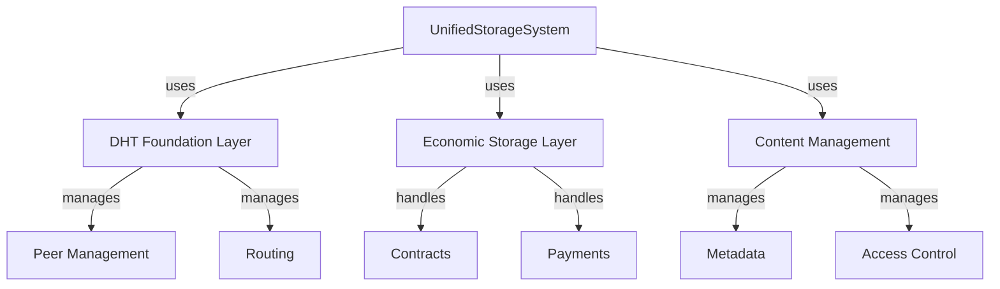

# Storage

# Storage Module Documentation

## Overview

The **Storage** module of the ZHTP Unified Storage System (`lib-storage`) provides a sophisticated multi-layer architecture for managing data storage, retrieval, and economic interactions within a distributed network. This module integrates various components, including a Distributed Hash Table (DHT) for data routing, an economic layer for incentivizing storage, and a content management system for handling user data.

## Purpose

The primary purpose of the Storage module is to facilitate efficient and secure storage operations while ensuring data integrity, privacy, and economic incentives. It allows users to upload, download, and manage content while leveraging the underlying DHT for decentralized storage and retrieval.

## Key Components

### 1. UnifiedStorageSystem

The `UnifiedStorageSystem` is the core struct that orchestrates all storage operations. It integrates various subsystems, including DHT management, economic management, and content management.

#### Key Functions:
- **`new`**: Initializes a new instance with in-memory storage.
- **`new_persistent`**: Initializes a persistent instance using `SledBackend`.
- **`upload_content`**: Handles the upload of content, integrating economic and content management.
- **`download_content`**: Retrieves content based on user requests.
- **`search_content`**: Searches for content across the storage system.

### 2. DHT Foundation Layer

The DHT layer is responsible for peer discovery, routing, and basic key-value operations. It utilizes the Kademlia algorithm to ensure efficient data retrieval and storage.

#### Key Functions:
- **`add_peer`**: Adds a new peer to the DHT network.
- **`get_node_info`**: Retrieves information about the local node.
- **`perform_maintenance`**: Conducts routine maintenance tasks, such as cleaning up expired data.

### 3. Economic Storage Layer

This layer implements the economic incentive system, allowing for dynamic pricing, storage contracts, and payment processing.

#### Key Functions:
- **`get_storage_quote`**: Provides a quote for storage based on user requirements.
- **`monitor_contract_performance`**: Monitors active contracts for compliance and performance.

### 4. Content Management

The content management system handles high-level operations related to user data, including metadata management, access control, and content retrieval.

#### Key Functions:
- **`store_identity_credentials`**: Stores user identity credentials securely.
- **`retrieve_identity_credentials`**: Retrieves stored identity credentials.
- **`list_identity_ids`**: Lists all identity IDs stored in the system.

### 5. Storage Backends

The module supports multiple storage backends, allowing for flexibility in data persistence. The primary backends include:
- **`SledBackend`**: A production-ready backend for persistent key-value storage.
- **`HashMapBackend`**: An in-memory backend for fast but volatile storage.

## Architecture

The architecture of the Storage module is designed to be modular and extensible. The following diagram illustrates the key components and their interactions:



## How It Works

1. **Initialization**: The `UnifiedStorageSystem` is initialized with a configuration that specifies the node ID, network addresses, and storage settings. Depending on the configuration, it can use either in-memory or persistent storage.

2. **Content Upload**: When a user uploads content, the `upload_content` function is called. This function processes the upload request, integrates economic considerations (e.g., pricing and contracts), and stores the content in the DHT.

3. **Content Retrieval**: Users can retrieve content using the `download_content` function. This function checks access permissions and retrieves the content from the DHT.

4. **Economic Management**: The economic layer monitors storage contracts and manages payments. It ensures that storage providers are incentivized based on performance and availability.

5. **Identity Management**: The content management system allows for secure storage and retrieval of user identities, ensuring that sensitive information is handled appropriately.

## Integration with the Codebase

The Storage module is tightly integrated with other components of the ZHTP Unified Storage System. It relies on the DHT for data routing and retrieval, the economic layer for managing incentives, and the content management system for handling user data. The module also interacts with the identity management system to ensure secure handling of user credentials.

### Example Usage

Here is a simple example demonstrating how to initialize the storage system and upload content:

```rust
use lib_storage::{UnifiedStorageSystem, UnifiedStorageConfig, UploadRequest};

// Initialize storage system
let config = UnifiedStorageConfig::default();
let mut system = UnifiedStorageSystem::new(config).await?;

// Upload content
let upload_request = UploadRequest {
    content: b"Hello, ZHTP Storage!".to_vec(),
    filename: "hello.txt".to_string(),
    // ... other fields
};

let content_hash = system.upload_content(upload_request, identity).await?;
println!("Content stored with hash: {}", hex::encode(content_hash.as_bytes()));
```

## Conclusion

The Storage module is a critical component of the ZHTP Unified Storage System, providing a robust framework for managing data storage, retrieval, and economic interactions. Its modular architecture allows for flexibility and extensibility, making it suitable for a wide range of applications in decentralized storage systems. Developers can contribute to this module by enhancing its features, optimizing performance, or integrating new storage backends.