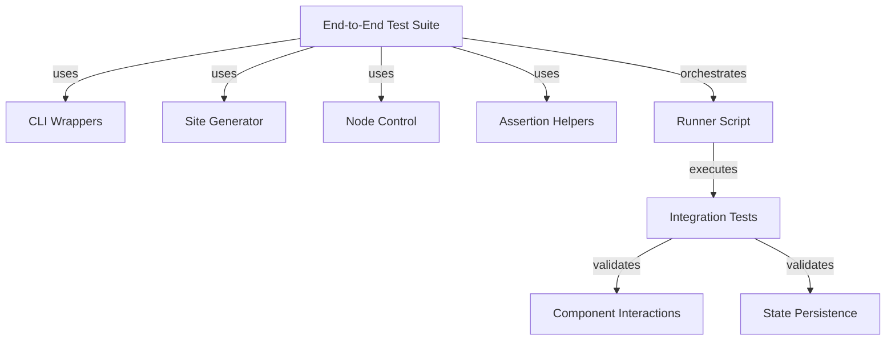

# Testing

# Testing Module Documentation

## Overview

The **Testing** module provides a comprehensive suite of tests for the Web4 CLI application, focusing on both end-to-end (E2E) and integration testing. It ensures that the application behaves as expected under various scenarios, validating the functionality of critical components and their interactions. This module is essential for maintaining code quality and reliability as the application evolves.

## Purpose

The primary purpose of the Testing module is to:
- Validate the functionality of the Web4 CLI application through automated tests.
- Ensure that components work correctly both in isolation and when integrated.
- Facilitate the detection of regressions and bugs during development.

## Key Components

The Testing module consists of several key components, each serving a specific role in the testing process:

### 1. End-to-End Test Suite

Located in `tests/e2e/`, this suite orchestrates a series of tests that simulate real-world usage of the Web4 CLI. It includes:

- **`lib/cli.sh`**: CLI wrappers and JSON extraction helpers for interacting with the command line interface.
- **`lib/site_generator.sh`**: Generates simple sites for deployment during tests.
- **`lib/node_ctrl.sh`**: Helper functions to start, stop, and restart the node using `run-node.sh`.
- **`lib/asserts.sh`**: Small assertion helpers to validate test outcomes.
- **`runner.sh`**: The main script that orchestrates the execution of the test phases.

### 2. Integration Tests

Located in `tests/integration/`, these tests focus on verifying the behavior of individual components and their interactions. Key tests include:

- **`test_orchestrator_restart_determinism.rs`**: Tests the persistence of identity and state across node restarts.
- **`test_zhtp_mesh_serialization.rs`**: Validates the serialization and routing of ZHTP messages through the mesh network.

### 3. Utility Functions

The module also includes utility functions for common tasks, such as creating temporary directories, reading and writing files, and initializing logging. These are defined in `tests/test_suite.rs` and are used across various tests to streamline setup and teardown processes.

### 4. Test Runner

The test runner script (`runner.sh`) is responsible for executing the tests in a defined sequence, ensuring that all necessary prerequisites are met before running the tests.

## Execution Flow

The execution flow of the tests can be summarized as follows:

1. **Initialization**: The test environment is set up, including logging and temporary directories.
2. **Test Execution**: Each test function is executed in isolation, with assertions to validate expected outcomes.
3. **Teardown**: Temporary resources are cleaned up after each test to ensure a clean state for subsequent tests.

### Mermaid Diagram

The following diagram illustrates the key components and their interactions within the Testing module:



## How to Contribute

To contribute to the Testing module, follow these steps:

1. **Create a Feature Branch**: Start from the `development` branch.
   ```bash
   git checkout development
   git pull origin development
   git checkout -b feat/e2e-tests-<issue_number>
   ```

2. **Add Your Tests**: Implement your tests in the appropriate directory (`tests/e2e/` for E2E tests or `tests/integration/` for integration tests).

3. **Run the Test Suite**: Ensure all tests pass locally before submitting your changes.
   ```bash
   bash tests/e2e/runner.sh
   ```

4. **Commit and Push**: Stage your changes and push to the remote repository.
   ```bash
   git add tests/e2e/
   git commit -m "tests(e2e): add tests for issue #<issue_number>"
   git push -u origin feat/e2e-tests-<issue_number>
   ```

5. **Open a Pull Request**: Target the `development` branch and reference the issue number in your PR description.

## Conclusion

The Testing module is a critical part of the Web4 CLI application, ensuring that the codebase remains robust and reliable. By following the outlined structure and contributing guidelines, developers can effectively add new tests and maintain the quality of the application as it evolves.